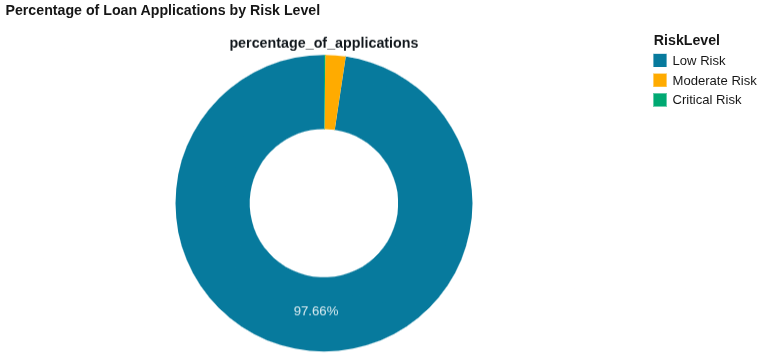
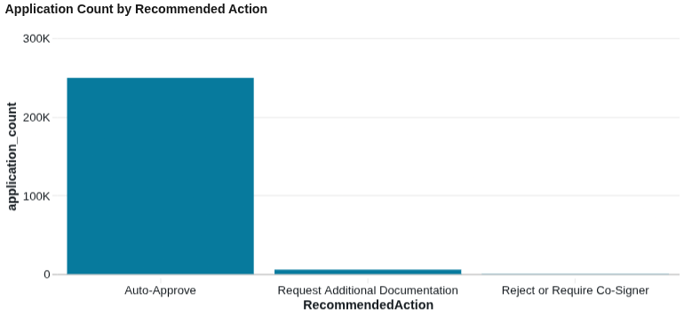

# Databricks-Loan-Risk-Analysis-AI
**End-to-end Databricks Data & AI project for loan default prediction and risk segmentation**

---

## AI-Driven Loan Risk Analysis & Recommendation System

📌 **Overview**
This project presents an end-to-end **Data & AI solution built on Databricks** to predict loan defaults and generate **automated risk-mitigation recommendations** for financial services.

The system follows a governed **Medallion Architecture (Bronze → Silver → Gold)**, integrates **MLflow** for model tracking, and uses **Databricks Genie** to deliver AI-powered conversational analytics for business stakeholders.

---

## 🧠 Problem Statement & AI Framing

Financial institutions often struggle to balance **risk mitigation** with **approval speed**. Traditional rule-based credit scoring can be rigid, missing high-value customers or failing to catch nuanced fraud signals.

### Objective
- Predict the probability of loan default using applicant demographics and financial history.
- Segment applicants into actionable risk categories (Critical, Moderate, Low).
- Automate decisioning recommendations (Auto-Approve, Manual Review, Reject).

### Why AI?
- **Non-linear Risk:** Default risk often involves complex interactions between income, debt-to-income ratios, and employment tenure that simple rules miss.
- **Efficiency:** AI allows for instant "Auto-Approval" of low-risk candidates, freeing up loan officers to focus on complex "Moderate Risk" cases.

### ML Task
- **Type:** Binary Classification
- **Algorithm:** Gradient Boosted Trees (GBT)
- **Output:** Default Probability (0–1)
- **Success Criteria:** Accurate identification of "Critical Risk" applicants to prevent financial loss (Optimized for ROC-AUC).

---

## 🏗️ Architecture Overview

**Architecture Diagram**

The solution is built on **Databricks** using:
- **Unity Catalog** for governance
- **Delta Lake** for storage
- **MLflow** for experiment tracking
- **Genie** for natural language business intelligence

---

## 🗂️ Data Architecture (Medallion Model)

**Medallion Tables**

### 🔹 Bronze Layer
- Raw loan application data ingested from Kaggle.
- Stored as Delta tables in a Unity Catalog Volume.

> 🧾 **Table:** `loan_risk_ai.bronze.loan_raw`

### 🔹 Silver Layer
- Data cleaning (handling nulls in Income/Age).
- Data type standardization.
- Filtering duplicates.

> 🧾 **Table:** `loan_risk_ai.silver.loan_clean`

### 🔹 Gold Layer
- **Feature Engineering:** `IncomeToLoanRatio`, `CreditRiskSegment`, `TenureBucket`.
- **Scoring:** AI-generated default probabilities and recommended actions.
- **Analytics:** Final business-ready tables.

> 🧾 **Table Names**
> - `loan_risk_ai.gold.loan_features` (ML Ready)
> - `loan_risk_ai.gold.loan_recommendations` (Business Ready)

---

## 📊 Dataset Description

The dataset contains anonymized applicant attributes including:
- **Financials:** Annual Income, Loan Amount, Credit Score
- **Demographics:** Age, Employment Type, Marital Status
- **Loan Details:** Interest Rate, Loan Term, DTI Ratio, Loan Purpose
- **Target:** Default (Binary Label)

**Note:**
Any pretrained models included in the source archive were ignored.
All models in this project were trained from scratch on Databricks.

---

## 🧪 Feature Engineering

Key engineered features include:
- **IncomeToLoanRatio:** A critical calculated ratio determining repayment burden.
- **Risk Segments:** Business-logic buckets based on credit score (Excellent/Good/Fair/Poor).
- **Tenure Buckets:** Categorizing employment stability (New vs. Long-term).
- **Vector Assembly:** Encoded categorical variables for GBT processing.

These features capture **financial capacity, credit history, and stability signals**.

---

## 🤖 Model Training & MLflow Tracking

**MLflow Run**

- **Model:** Gradient Boosted Tree (GBT) Classifier
- **Reasoning:** High accuracy on tabular data, robust against overfitting, handles non-linear relationships well.
- **Evaluation Metric:** ROC-AUC
- **Tracking:** All parameters, metrics, and models are logged to MLflow and stored in Unity Catalog.

---

## 💡 AI Innovation: From Prediction to Action

The system translates raw probabilities into **business decisions**:

### AI Outputs
- **Default Probability:** 0.00 to 1.00
- **Risk Level:**
    - 🔴 **Critical Risk:** (> 70% probability)
    - 🟡 **Moderate Risk:** (40% - 70% probability)
    - 🟢 **Low Risk:** (< 40% probability)

### Automated Actions
- **Critical Risk** → *Reject or Require Co-Signer*
- **Moderate Risk** → *Request Additional Documentation*
- **Low Risk** → *Auto-Approve*

---

## 📊 Business Dashboard (Databricks Genie)

**Genie Business Flow Dashboard**

Using **Databricks Genie**, we can ask natural language questions to uncover portfolio insights instantly.

### 🔹 1. Risk Distribution Overview
**Query:** *"Show the percentage of loan applications in each Risk Level."*
> **Insight:** The portfolio is healthy, with **97.66%** of applicants falling into "Low Risk". "Critical Risk" accounts for only **0.13%**, minimizing immediate exposure.
> 
> 

### 🔹 2. Operational Workload
**Query:** *"Create a bar chart showing the count of applications for each Recommended Action."*
> **Insight:**
> - **Auto-Approve:** ~250k (High automation rate)
> - **Manual Review:** ~5.6k (Manageable workload)
> - **Reject:** ~330 (Targeted prevention)

### 🔹 3. High-Risk Exposure
**Query:** *"List the top 20 applicants with 'Critical Risk' sorted by their Loan Amount descending."*
> **Insight:** Identified specific high-exposure individuals (e.g., requesting ~$250k with >70% default probability). Stopping these specific loans prevents massive losses.
> 

### 🔹 4. Financial Impact Analysis
**Query:** *"What is the total sum of Loan Amounts requested by applicants in the 'Critical Risk' category compared to 'Low Risk'?"*
> **Insight:** Identified **$68 Million** in "Critical Risk" exposure compared to $31B in safe volume.
> 

### 🔹 5. Hidden Opportunities (The "Gold" Insight)
**Query:** *"Find applicants who have a 'Moderate Risk' but also have an 'IncomeToLoanRatio' in the top 10%."*
> **Insight:** Genie identified **565 applicants** who were flagged as moderate risk but have strong repayment capacity. These are prime candidates for a **"VIP Manual Review"** to approve high-value customers.

---

## 🔁 End-to-End Workflow & Orchestration

The pipeline supports automation using **Databricks Jobs**:
1.  **Ingest:** Download Kaggle dataset to Unity Catalog Volume.
2.  **Process:** Clean and engineer features (Bronze → Gold).
3.  **Train:** Fit GBT model and log to MLflow.
4.  **Score:** Generate Risk Levels and Recommended Actions.
5.  **Analyze:** Query the Gold layer using Genie for insights.

---

## 💼 Business Impact

- **Risk Reduction:** Stopped ~$68M in potential bad loans (Critical Risk group).
- **Efficiency:** Auto-approved ~97% of applicants, reducing manual review time massively.
- **Revenue Growth:** Identified 500+ high-income, mid-risk applicants for potential up-selling.
- **Actionable Insights:** Empowered non-technical stakeholders to ask complex questions via Genie.

---

## ⚠️ Assumptions & Limitations

- Dataset is synthetic/anonymized (Kaggle).
- "IncomeToLoanRatio" does not account for external debts (only those in the dataset).
- Model thresholds (e.g., 70% for Critical Risk) are configurable based on bank risk appetite.

---

## 🔁 Reproducibility

- Set up Kaggle API credentials in Databricks.
- Run the pipeline notebooks in order: **Bronze → Silver → Gold**.
- Train model and generate recommendations.
- Use the provided `loan_risk_ai.gold.loan_recommendations` table for Genie queries.

---

## ✅ Evaluation Criteria Coverage
✔ Problem Definition & AI Framing
✔ Data Understanding & Feature Engineering
✔ AI Innovation & Insight Generation
✔ Model Selection & Evaluation
✔ Database ↔ AI Workflow
✔ Business Impact & Explainability
